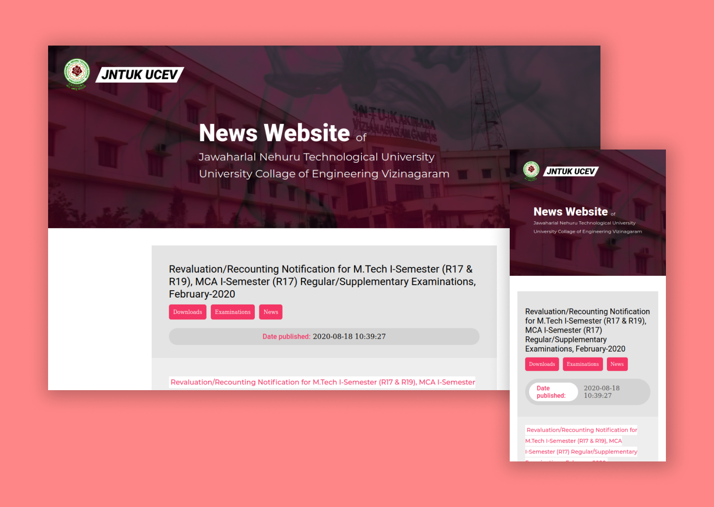

# JNTUV NEWS made With React js

live website: https://jntuvnews.vercel.app

This tiny project is done because its a bit confusing to get the latest news form official website, because the Wordpress theme they use is a bit confusing. Hence i made this webpage which directly pulls the rss feed from the official website and display it in cleaner way with React.

I used Axios module, rss2json api, and cors anywhere to fetch the xml rss feed form the official website of jntukucev.ac.in which uses wordpress.
* this is done by calling get request by axios inside a useEffect by combined url of rss feed converted to json from external api (https://api.rss2json.com/v1/api.json?rss_url=http://jntukucev.ac.in/feed/) and cors-proxy(https://cors-anywhere.herokuapp.com/). this all process is done in PostsSection.js file.
* this data is later neatly represented through "Post" component and these "Post" components is maped inside PostsSection with inputing the required props inside          the PostsSection.js file 

**NOTE:**
The images cannot be rendered if this website is hosted with https protocol since the official website (www.jntukucev.ac.in) doesnot have a valid SSL Certifiate at this moment. Hence i made images to links in the live website. (https://jntukucev.netlify.app/ - this is the live demo of the website with out styling of images)
